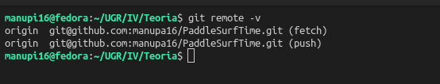

# PaddleSurfTime

## Descripción del Problema

Soy un apasionado del deporte y este verano he empezado a practicar paddle surf. Durante estos meses me he ido moviendo por diversas playas de Málaga, Murcia y Granada, y mi problema es que en varias de ellas, pese a que hubiera bandera verde y el baño estuviera permitido, no podía practicarlo, ya que el mar no estaba en condiciones para hacerlo de forma óptima.

Esto se debía a que hacía viento, que daba lugar a pequeñas corrientes o incluso, muchas veces, a olas que, por muy pequeñas que fueran, imposibilitaban la práctica. Y todo esto no era previsible, ya que, pese a que podía consultar las banderas o el viento, eso no me confirmaba si era posible practicar paddle surf. Por eso, unas 10-15 veces no pude sacar la tabla y tuve que coger el coche hacia otro lugar a ver si encontraba una playa donde sí se pudiera, lo que me supuso una gran pérdida de tiempo y gasolina, además de un hartazgo increíble.

## Fotos del Juego de Rol 

A continuación muestro las fotografías de las tarjetas del juego de rol realizado el primer día de clase.

## Configuración del Entorno

Finalmente muestro la documentación asociada a la configuración correcta del entorno de trabajo.

**Conexión SSH configurada**

**Repositorio Conectado Mediante SSH**

**Nombre y Correo configurados para git**

**Avatar de GitHub**

