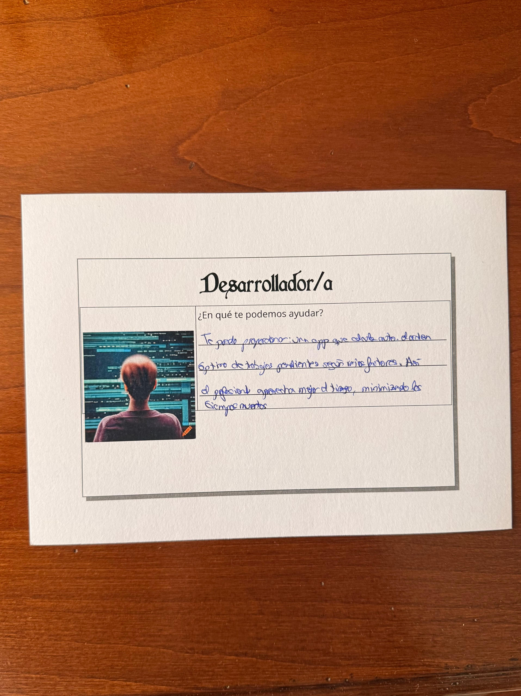
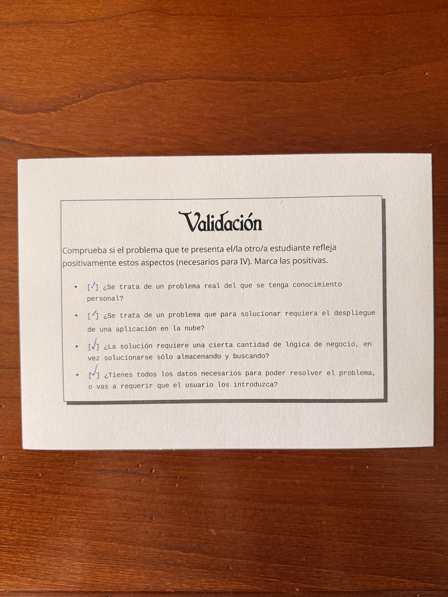
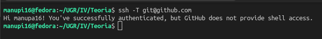
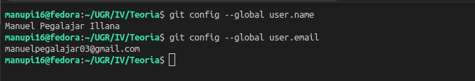
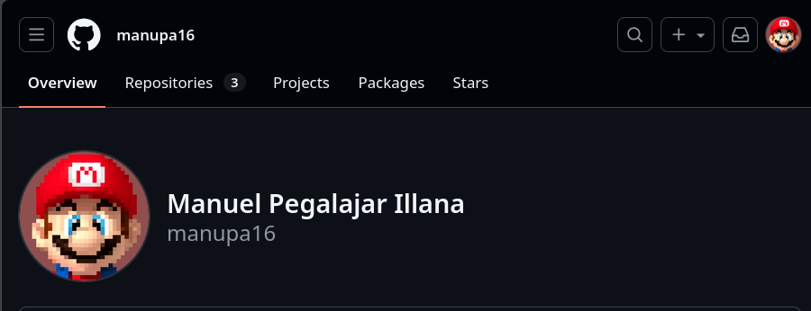

# DebtLess

Soy un viajero que hace viajes con muchos grupos de amigos durante el año. Tengo el problema de que cuando me voy de viaje con ellos a la hora de compartir gastos resulta un caos. Esto se debe a que siempre alguien no lo hace a tiempo y lo deja pasar o incluso al ser muchas personas es costoso, y al final toca cuadrar las cuentas y calcular los cambios a mano.
De manera que siempre acabamos haciendo muchos bizums o transferencias los unos a los otros, situación que se repite en cada viaje.
Para solucionar esto, necesito una app que permita el acceso de varios usuarios a la vez y que funcione en tiempo real, ya que necesito en todo momento que todos los viajeros tengan conocimiento de los pagos que se realizan, cuándo se realizan y quiénes están involucrados en ellos. Si estuviera a nivel local en mi móvil, por ejemplo, no estarían los datos sincronizados ni actualizados para que mis amigos pudieran verlos en todo momento.
Una vez tenga la app todos los pagos centralizados y sincronizados, la idea sería desarrollar un algoritmo de manera que teniendo en cuenta todos los gastos se calculen las menores transacciones que se tengan que realizar los unos a los otros. Este cálculo no es trivial, ya que no es simplemente almacenar unas cantidades de dinero y restarlos, se tiene que estudiar los diversos casos, considerando el conjunto de todos los balances de cada persona para encontrar la combinación que requiera menos transacciones, incluso si eso implica que alguien acabe pagando a alguien con quien, en principio, no tenía ninguna deuda directa.
Para que el algoritmo pueda funcionar, necesita conocer los detalles de cada pago, como el importe, concepto, fecha o quién paga qué. Sin embargo esta información la ha de introducir el usuario, y no se encuentran almacenados en ningún lugar. De estos, importe y personas involucradas son imprescindibles porque se necesita saber cuánto ha sido el cobro y a qué personas les corresponde, mientras que concepto y fecha sirven para poder ubicar cuándo y de qué ha sido el cobro.

## Fotos del Juego de Rol 

A continuación muestro las fotografías de las tarjetas del juego de rol realizado el primer día de clase.

## Configuración del Entorno

Finalmente muestro la documentación asociada a la configuración correcta del entorno de trabajo.

