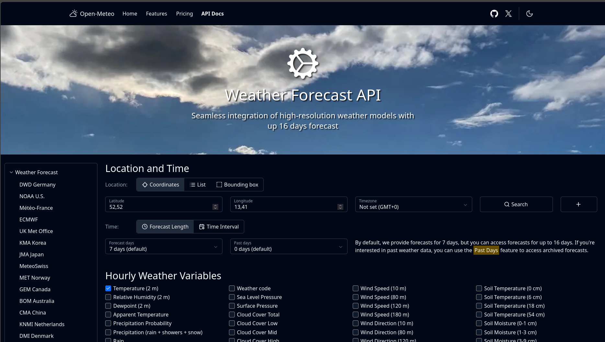
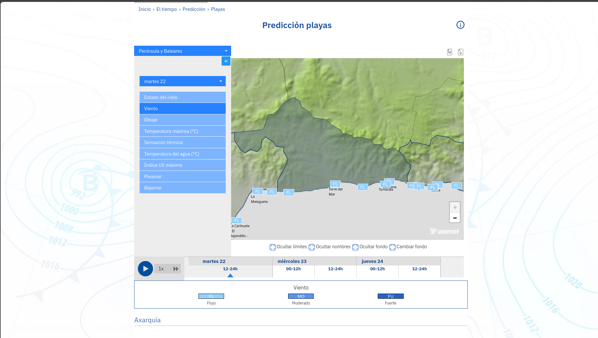
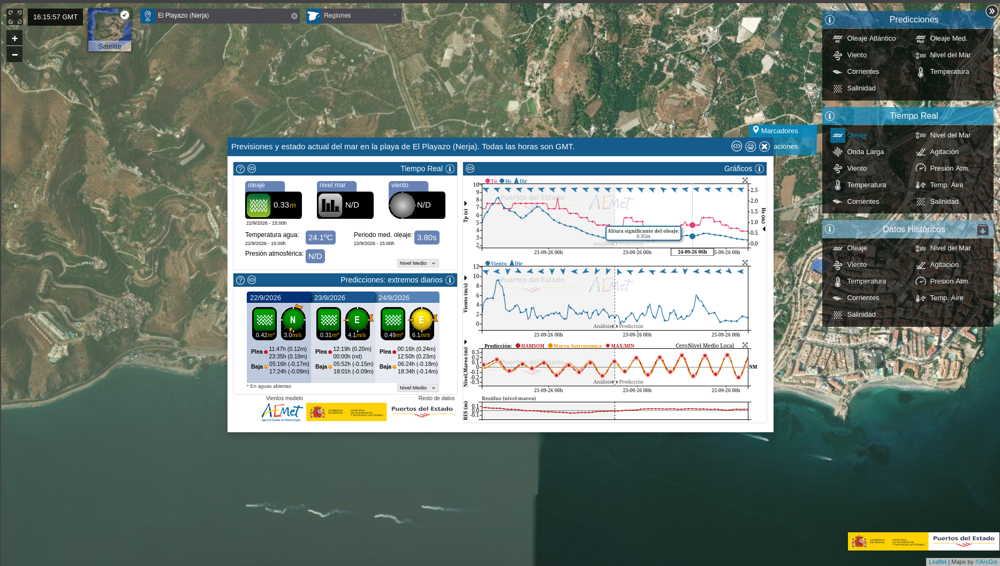
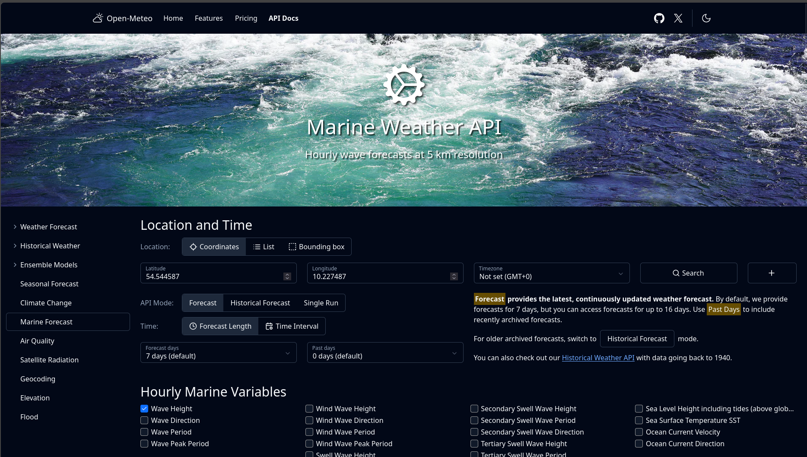
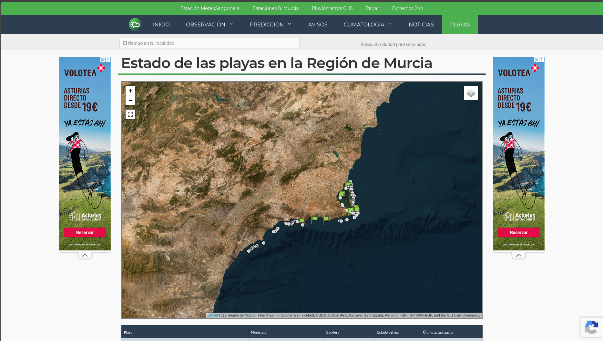

# Fuentes de Datos y Heurística

## Fuentes de datos

No he encontrado ningún sitio donde se recoja toda esta información y que indique si se puede practicar paddle surf. Sin embargo, si he encontrado distintas fuentes (semiestructurados) de las que obtener y poder extraer cada uno de los datos necesarios.

### Viento(Dirección y Fuerza)

Para encontrar información acerca del viento encontré una API llamada **Open-Meteo** , así como la propia página de la **AEMET.**

- [Open-Meteo](https://open-meteo.com/)

- [Predicción de viento en playas de AEMET](https://www.aemet.es/es/eltiempo/prediccion/playas)

### Oleaje

En relación al oleaje, cabe destacar que he encontrado una fuente de información muy interesante como es la la página de puertos del estado. Además, de que **Open-Meteo** , dispone de un apartado para ver las características del oleaje aportando únicamente las coordenadas.

- [Puertos del Estado](https://portus.puertos.es/)

- [Open-Meteo Marine Weather API](https://open-meteo.com/en/docs/marine-weather-api)

### Banderas

Para las banderas es cierto que no hay ningún sitio en común, ya que cada zona las publica de distintas maneras, por ejemplo en Málaga se hace a través de una cuenta de la red social **X** , mientras que en la Región de Murcia es distinto.

- [MeteoSangonera](https://www.meteosangonera.es/playas/)

### Ubicación de las Playas

Por último destacar que la ubicación de las playas la podemos obtener directamente a través de la **AEMET** ya que también las almacena.

### Heurística

Luego observamos que cada fuente da los datos de una forma distinta (datos semiestructurados), luego necesitaremos extraerlos  y unificarlos por playa y hora, para poder trabajar con ellos.
Después aplicaremos una heurística que:

1. Descarta las playas de bandera roja y amarilla.
2. Compara la dirección del viento con la orientación de cada playa, ya que el el viento que sopla mar adentro es el peligroso.
3. Verifica que el viento y las olas se encuentran por debajo de un umbral.
4. Por último, elige la mejor de las playas que quedan, teniendo en cuenta cuántas horas seguidas se mantienen las buenas condiciones y la distancia a la que está cada una.